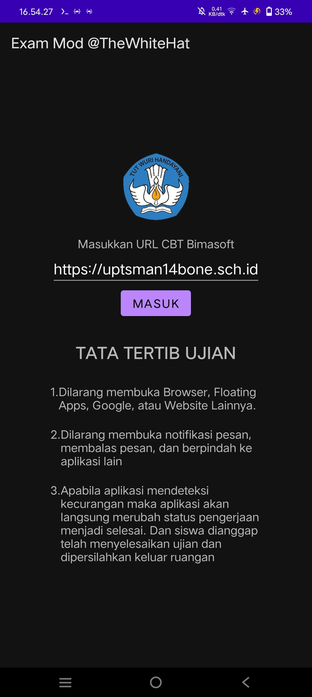
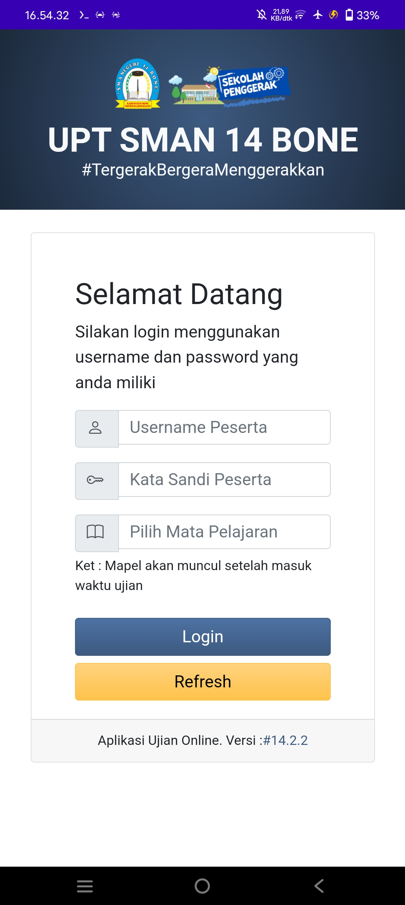
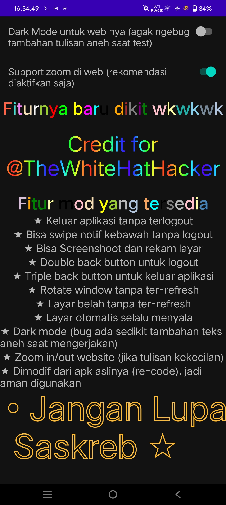

# Exam Mod Bimasoft
[](https://github.com/0x617375/Exam-Mod/actions/workflows/build.yml)


Sebuah mod dari aplikasi [bimasoft](https://play.google.com/store/apps/developer?id=Bimasoft+Total+Solution) contoh dari modif aplikasinya [ini](https://play.google.com/store/apps/details?id=id.web.bimasoft.sman14bonev54) beserta source codenya agar dapat dicustom sesuka hati.

Aplikasi dapat didownload [di sini](https://github.com/0x617375/Exam-Mod/releases) atau langsung download [di sini](https://github.com/0x617375/Exam-Mod/releases/download/v1.3/exammod-v1.3.apk).

Laporkan [di sini](https://github.com/0x617375/Exam-Mod/issues/new/choose) jika ada masalah atau ingin bertanya. Jangan lupa sertakan link aplikasi yang kamu gunakan atau upload file apknya dalam bentuk zip agar bisa diupload.

**Sebenarnya ini hanyalah perantara antara ujian berbasis website yang harus menggunakan aplikasi exam agar diizinkan masuk web ujian. Segala bentuk aplikasi exam lain yang susah dipahami dan membutuhkan usaha lebih untuk dimodifikasi silakan modifikasi sendiri. Toolsnya bisa dengan MT Manager, App Manager, ApkTool, dll buat reverse engineering apk android. Pahami kode java, xml, smali.**

Note: custom user agent pada setting kosongkan saja jika aplikasi masih dapat berjalan normal. Kalau tidak dapat akses kemungkinkan karena user agent harus sama. Buka saja pertanyaan dan berikan url/file apk dalam zip dan nanti aku cari nama user agent atau masalahnya agar aplikasi dapat berjalan normal

**Admin tidak bertanggung jawab dengan segala risiko yang pengguna terima**.


## Screenshots
|            Screenshot di Homepage             |            Screenshot di Webview            |            Screenshot di Settings             |
| --------------------------------------------- | ------------------------------------------- | --------------------------------------------- |
|  |  |  |


## Fitur yang tersedia
- [x] Keluar aplikasi tanpa terlogout
- [x] Bisa swipe notif kebawah tanpa logout
- [x] Bisa Screenshoot dan rekam layar
- [x] Double back button untuk logout
- [x] Triple back button untuk keluar aplikasi
- [x] Rotate window tanpa ter-refresh
- [x] Layar belah tanpa ter-refresh
- [x] Layar otomatis selalu menyala
- [x] Dark mode (bug ada sedikit tambahan teks aneh saat mengerjakan)
- [x] Zoom in/out website (jika tulisan kekecilan)


## 3 Cara mendapat url exam web

### Cara pertama (paling mudah)
1. Download [personalDNSfilter](https://play.google.com/store/apps/details?id=dnsfilter.android) dan buka. Izinkan sambungan vpn dan klik centang sampai ada log situs apa aja yang terdeteksi
2. Pastikan apk exam terclose, buka ulang dan masuk ke dalam website.
3. Cek personalDNSfilter untuk situs baru yang diakses. 
4. Link exam biasanya ada nama sekolah kalian, singkatannya, serta ada kata cbt/exam di dalamnya. Copas saja link itu dan tempelkan pada bagian url.
5. Buka apk personalDNSfilter dan tekan close
6. Tekan masuk pada exam dan sudah berhasil.

### (not work anymore) Cara kedua (lumayan gampang daripada yang ketiga, kadang link ter-obfus, rekomen cara 1 saja)
1. Download [AEE](https://github.com/apk-editor/APK-Explorer-Editor/releases/download/v0.29/app-full-release.apk) dan buka.
2. Cari nama apk exam kamu dan tekan, pilih simple decompile dan buka classes.dex.
3. Buka folder id/web/bimasoft/.../MainActivity.smali
4. Scroll sampai bawah dan cari url yang berawalan https dan salin.
5. Tempelkan pada aplikasi Exam Mod dan masuk

### (not work anymore) Cara ketiga (buat developer pro aja, kadang link juga ter-obfus, rekomen cara 1 saja)
Sebagai contoh aplikasi ujian [EXAM CLIENT SMAN 14 BONE v54](https://play.google.com/store/apps/details?id=id.web.bimasoft.sman14bonev54) ini

1. Download terlebih dahulu aplikasi exam diatas
2. Download dan install Appmanager [di sini](https://github.com/MuntashirAkon/AppManager/releases/download/v4.0.0-beta02/AppManager_v4.0.0-beta02.apk) atau versi sesuai yang kalian inginkan [di sini](https://github.com/MuntashirAkon/AppManager/releases)
3. Buka dan izinkan saja izin aplikasi yang diminta agar tidak error dan ini aman
4. Saat opsi keystore tutup saja
5. Centang jangan tampilkan lagi dan saya setuju
6. Tunggu sampai aplikasi selesai dimuat, cari aplikasi exam, dan klik exam
7. Klik kanannya direktori sumber pada bagian seperti meluncur dan buka dengan appmanager explore/menjelajahi
8. Klik base.apk dan buka dengan menjelajahi
9. Tekan classes.dex dan buka lagi dengan menjelajahi
10. Buka folder id/web/bimasoft/sman14bonev54
11. Tekan MainActivity dan buka dengan code editor app manager 
12. Tekan java pada kanan atas agar mudah dibaca
13. Cari awalan https atau manual yang berisi url
14. Disini kita menemukan url yaitu https://uptsman14bone.sch.id
15. Copy dan paste saja ke aplikasi dan selamat anda telah curang yaitu hacking

## Cara mendapatkan user agent
1. Butuh linknya dulu, cara diatas
2. Downlaod [Kiwi Browser](https://play.google.com/store/apps/details?id=com.kiwibrowser.browser), buka dan langsung load url
3. Buka titik 3 kanan atas dan aktifkan Developer tools
4. Pindah tab ke url tadi dengan tekan ikon kotak di kanan atas dan refresh halamannya
5. Balik ke dev tools dan cari bagian Network
6. Klik 2x pada url yang mengandum kata cbtindex dan akan muncul json
7. Klik titik 3 dan cari pada halaman, masukkan kata useragent
8. Nah pada bagian "useragent":"..." itu adalah useragent yg perlu diberikan di setting

## Tanya jawab
- Kenapa nama apknya withX? X itu sebenarnya AndroidX Jetpack yang awalnya tidak saya gunakan pada awal proyek
- Kenapa gagal install meski sudah klik selengkapnya dan tanpa memindai tidak bisa? Sebenarnya ini hanya karena google play tidak mengenali developer. Buka aplikasinya sekali lagi dan install nanti bisa


## Credit 
- [Totond](https://github.com/totond) for [TextPathView](https://github.com/totond/TextPathView)
- [Hanks-zyh](https://github.com/hanks-zyh) for [HTextView](https://github.com/hanks-zyh/HTextView)
- [GrenderG](https://github.com/GrenderG) for [Toasty](https://github.com/GrenderG/Toasty)


### Keyword
- Exambro
- Exam mod 
- Mod Exam
- Exam Browser
- Browser Exam
- Exambro Android
- Exam mod Android
- Mod Exam Android
- Exam Browser Android
- Browser Exam Android
- Browser Exam Client Android


#### Kode asal
```java
void hackExam(String msg){
     alert(msg);
}

hackExam("You have been hacked!");
```
```rust
fn main(){
   anjay!();
}
```
